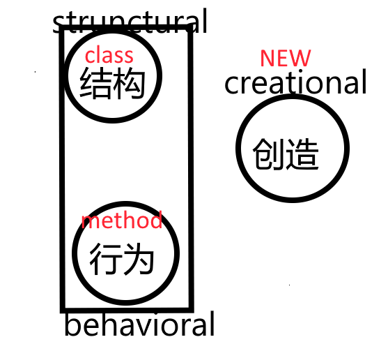

A sample command-line application with an entrypoint in `bin/`, library code
in `lib/`, and example unit test in `test/`.

# 1. 软件设计模式
---


- **结构**类比就是结构class或者是结构体
- **行为**类比class里面的函数
- **创造**的话，是构造出结构，让结构和行为能够发挥作用

---

- Design patterns are not a silver bullet to all your problems.
- Do not try to force them; bad things are supposed to happen, if done so.
- Keep in mind that design patterns are solutions to problems, not solutions finding problems; so
  don't overthink.
- If used in a correct place in a correct manner, they can prove to be a savior; or else they can
  result in a horrible mess of a code.

## 行为

## 结构

## 创造(6)

- target
    - 实例一个或者一组对象
    - 当创造Object的时候频率比较高且需要一定的逻辑导致任务繁忙的时候，就需要看是否能够控制Object的创建解决创建的问题

#### 1. simple factory(简单工厂)

- explanation
    - 要什么直接给给什么，屏蔽内部细节
    - 组成
        - 产品接口
        - 工厂
        - 工厂根据传来的标识返回生成出对应的产品

#### 2. factory method(工厂方法)

- explanation
    - 将自己的大量任务delegate(分派)出去
    - 工厂方法模式在需要更好的封装、扩展性和解耦的场景下是一个合适的选择。当你预计系统中会有多个相似但不同的产品时，工厂方法模式可以帮助你更好地组织和管理对象的创建过程。
    - 工厂方法比比简单工厂管理的更复杂
    - 组成
        - 产品接口
        - 工厂接口
        - 一个工厂对应一个产品

#### 3. abstract factory(抽象工厂模式)

- explanation
    - 抽象工厂模式的主要目的是创建一系列相关或相互依赖的对象(意思是仅仅生产subclass)
    - 抽象工厂是一种设计模式，它提供了一种在不指定具体类的情况下创建一系列相关或依赖对象的接口。该模式属于创建型设计模式，旨在提供一种方法来组织和创建一组相关或依赖的对象，而无需指定其具体的类。
    - 抽象工厂模式可以理解为：需要设计某一类产品，这一类产品又可以是由其他的产品A(
      或者叫做产品家族,A这种子产品可能有多个)组成，但是A有各种类型的，因此需要设计一个A类产品的接口，同时也设计不同的A的拥有者的接口，实现这些接口
    - 组成
        - 产品 interface，工厂 interface
        - 具体的产品，具体的工厂
        - 一个工厂里面可以生产多种产品

#### 4. builder 模式

- explanation
    - Builder 模式是一种创建型设计模式，主要用于创建一个复杂对象，通过一步一步的构建，最终得到完整的对象。它将一个复杂对象的构建与表示分离，使得同样的构建过程可以创建不同的表示。
    - 组成
        - 1.被build的实体类
        - 2.builder 的接口(实现对实体类的每一个属性的设置，可以看成是将 construct
          给外置了，最后也要提供一个返回该实体类的方法)
        - 3.实现 builder 的具体 builder(具体的builder需要有一个属性为<span style="color:red">
          *实体类*</span>)
        - 3.Director, 根据传来的 builder 构造对应的实体类

#### 5. prototype 模式

- explanation
    - Create object based on an existing object through cloning.
        ```dart
        import 'dart:convert';
        
        /// 根据原型进行深拷贝
        /// 通过克隆在现有对象的基础上创建对象。
        /// dart 标准库没有提供 copy 相关的功能，需要使用第三方库或者自己实现
        abstract class Cloneable<T> {
          T clone();
        }
        
        class ProductPrototype implements Cloneable<ProductPrototype> {
          String? typeName;
          List infoList = <dynamic>[];
        
          ProductPrototype();
        
          ProductPrototype.setAll(this.typeName, this.infoList);
        
          @override
          ProductPrototype clone() {
            // TODO: implement clone
            List infoListCloned = [];
            infoListCloned.addAll(infoList);
            return ProductPrototype.setAll(typeName, infoListCloned);
          }
        
          Map<String, dynamic> toJson() => {'typeName': typeName, 'infoList': infoList};
        
          @override
          String toString() => jsonEncode(toJson());
        }
        
        void main() {
          ProductPrototype productPrototype =
          ProductPrototype.setAll("typeA", [1, 2, 3, 4, 5, 6]);
          print(productPrototype); // {"typeName":"typeA","infoList":[1,2,3,4,5,6]}
        
          ProductPrototype clone = productPrototype.clone();
          clone.infoList[0] = 0;
          print(productPrototype); // {"typeName":"typeA","infoList":[1,2,3,4,5,6]}
          print(clone); //{"typeName":"typeA","infoList":[0,2,3,4,5,6]}
        }
                
        ```

#### 6. singleton 模式

- explanation
    - Ensures that only one object of a particular class is ever created.
    - 可以看成一个班级里面的班主任，学生有事情都需要向班主任汇报，班主任始终是一个班主任
    - 可以有5种实现方法

# 参考以及资源

- [github](https://github.com/kamranahmedse/design-patterns-for-humans?tab=readme-ov-file#creational-design-patterns)
- [github上使用dart语言编写的代码](https://github.com/sqmw/design-pattern)